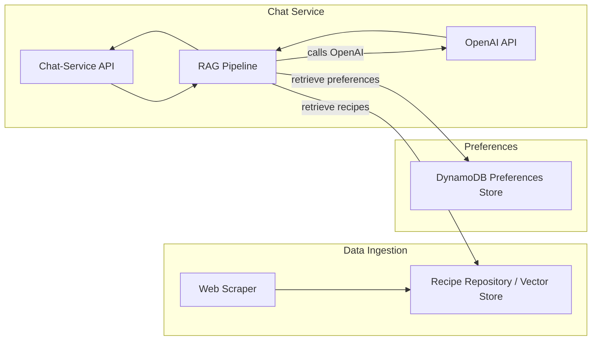
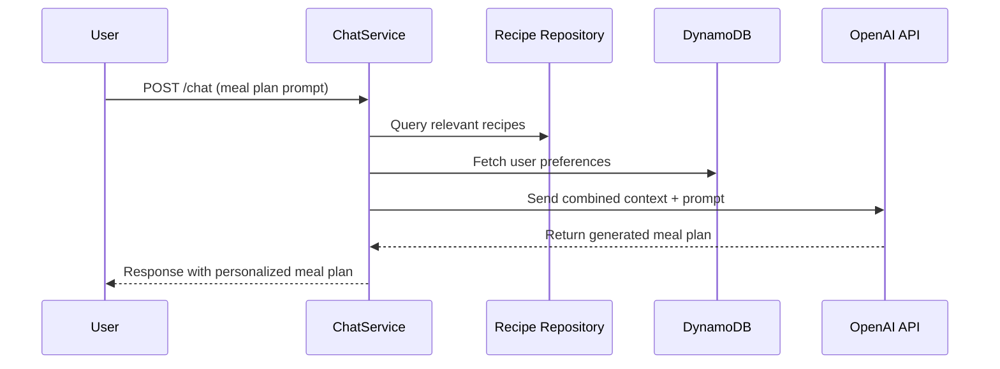

# Chat-Service Architecture

## Overview
The **chat-service** is a Spring Boot-based microservice leveraging [Spring AI](https://github.com/spring-projects/spring-ai) to connect to OpenAI for question answering and content generation. The key goal of this service is to provide **meal planning recommendations** (via Retrieval-Augmented Generation, or RAG) by combining information from two data sources:
1. **Recipe Blog Posts** – Scraped from various cooking/recipe websites.
2. **User Preferences** – Stored in a DynamoDB table, reflecting feedback and likes/dislikes.

Upstream services can call the **chat-service** API to generate meal plans for a single parent who needs to plan weekly meals.

---

## Components

### 1. Chat-Service (Spring Boot)
- **API Layer**: Exposes REST endpoints for chat and meal planning prompts.
- **Business Logic**: Implements the RAG pipeline, orchestrates data retrieval from recipe knowledge base and user preferences, and integrates with OpenAI via Spring AI.
- **Model/Entities**: Defines request/response objects, as well as internal models to represent recipes and user preferences.

### 2. Spring AI Integration
- **OpenAI Connection**: Responsible for orchestrating calls to OpenAI for text completion or chat-based LLM tasks.
- **Prompt Engineering**: Embeds relevant information (scraped recipes + user preferences) into the prompt sent to OpenAI to generate context-aware meal suggestions.

### 3. Recipe Data Store (Scraped Blog Posts)
- **Scraping Process**: A separate scraper process (or scheduled job) fetches blog posts from recipe websites.
- **Data Transformation**: Recipes are parsed to extract:
    - **Ingredients**
    - **Cooking duration**
    - **Other meta-information** (e.g., cuisine type, dietary restrictions)
- **Storage**: Could be stored in an internal database, search index, or vector store to facilitate semantic retrieval.

### 4. DynamoDB (Preferences Store)
- **Schema**: Contains feedback documents reflecting user preferences, e.g. likes/dislikes or other meal planning constraints.
- **Usage**: The RAG pipeline fetches these preference documents as additional context for the LLM to personalize meal suggestions.

### 5. Retrieval-Augmented Generation (RAG) Pipeline
1. **Receive Prompt**: The chat-service receives a user or system prompt requesting meal planning advice or recipe suggestions.
2. **Retrieve Relevant Documents**:
    - **Recipe Documents**: Fetched from the recipe repository or vector store.
    - **User Preferences**: Fetched from the DynamoDB table to incorporate user context.
3. **Build Context**: Combine relevant recipe data + preferences into a single context bundle.
4. **Call OpenAI**: Pass the combined context and user prompt to OpenAI through Spring AI.
5. **Generate Response**: Return the LLM output to the user.

---

## High-Level Architecture Diagram

1.	Data Ingestion: A web scraper populates the recipe repository.
2.	Preferences: User feedback and preferences are stored in DynamoDB.
3.	Chat Service: The chat-service exposes a REST API, orchestrates retrieval of data from both sources, and invokes OpenAI.

## Sequence Diagram (User Interaction)

1.	The User sends a prompt (e.g., “Plan meals for next week”).
2.	Chat-Service retrieves the relevant recipes from the Recipe Repository and the user’s preferences from DynamoDB.
3.	Both sets of documents are passed to the OpenAI LLM for content generation.
4.	The generated meal plan is returned to the User.

## Technology Stack
•	Spring Boot: Microservice framework for building RESTful services in Java.
•	Spring AI: Wrapper and utility library that simplifies integration with OpenAI’s LLMs.
•	OpenAI: Provides the text generation and understanding capabilities.
•	DynamoDB: Stores user preference documents for personalization.
•	Scraper: A custom or third-party tool that scrapes recipe data from target websites.

## Key Considerations
### Scalability:
•	Chat-service can be stateless and horizontally scaled.
•	Recipe data and user preference lookups should handle increased load (e.g., using DynamoDB’s auto-scaling features).
### Data Quality:
•	Scraped data must be cleansed and normalized to ensure consistent and meaningful context for the LLM.
### Personalization:
•	User feedback is critical for generating more personalized meal plans.
•	The design must handle ongoing updates to preferences (like new dietary restrictions or disliked ingredients).
### Security:
•	Ensure that endpoints are secure and that user preference data is protected.
•	OAuth 2.0 or token-based authentication might be used to secure API calls.
### Observability:
•	Logging, metrics, and tracing should be in place to monitor calls to OpenAI and DynamoDB.
